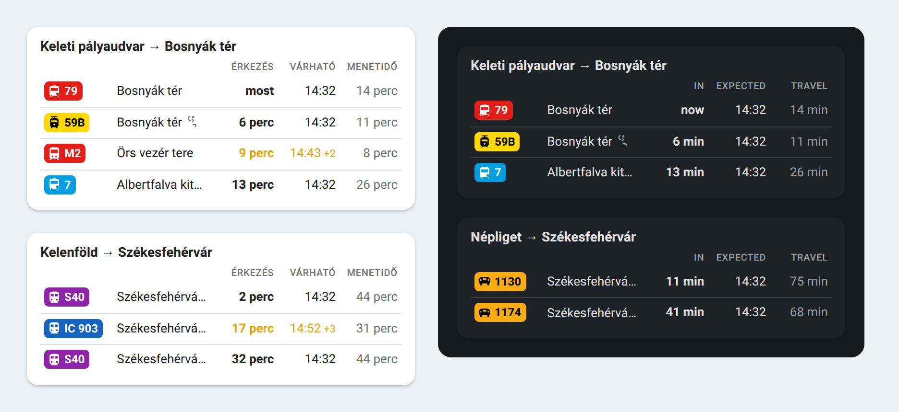

# Hungarian transport

[![hacs][hacs-badge]][hacs-url]
[![release][release-badge]][release-url]

Home Assistant dashboard card for **BKK**, **MÁV** and **Volán** journeys.

Pick an origin and a destination, and the card lists the next departures between
those two stops. City and rail traffic come from the live BKK FUTÁR API, and
long-distance coaches from the official KTI Volán GTFS feed.

The editor and the card are available in **Hungarian and English**. By default
they follow the Home Assistant user's language; you can also pin one explicitly.



## Install

### HACS

1. HACS → Frontend → ⋮ → Custom repositories → add this repository with
   category **Dashboard**.
2. Download **Hungarian transport**.
3. HACS adds the Lovelace resource automatically. If you manage resources by
   hand, add:

   ```yaml
   url: /hacsfiles/hungarian-transport/hungarian-transport.js
   type: module
   ```

   `type: module` is required — the card resolves its own asset paths from the
   module URL.

### Manual

Copy `hungarian-transport.js` to `/config/www/hungarian-transport/` and add the
matching `/local/hungarian-transport/hungarian-transport.js` resource.

## Setup

Add the **Hungarian transport** card from the card picker. The editor asks for a
BKK Open Data API key, which is free after a short sign-up:
<https://opendata.bkk.hu/data-sources>

The key is stored in the card configuration. If another Hungarian transport card
on the same dashboard already has one, the editor reuses it.

## Options

| Option | Type | Default | Description |
| --- | --- | --- | --- |
| `type` | string | — | `custom:bkk-stop-card-r3` |
| `apiKey` | string | — | BKK Open Data API key |
| `language` | string | `auto` | `auto`, `hu` or `en`. `auto` follows the Home Assistant user's language. |
| `name` | string | `origin → destination` | Card header |
| `stopId` | string | — | Origin stop, set by the editor |
| `stopName` | string | — | Origin stop name |
| `destKey` | string | — | Destination key, set by the editor |
| `destName` | string | — | Destination stop name |
| `routeIds` | list | `[]` | Routes serving the destination, filled by the editor |
| `mav` | bool | `false` | MÁV mode: rail stations and trains only |
| `volan` | bool | `false` | Volán mode: long-distance coaches |
| `refresh` | number | `45` | Seconds between departure refreshes, minimum 15 |
| `volanIndex` | string | next to the card | URL of `volan-index.json.gz` |

### Example

```yaml
type: custom:bkk-stop-card-r3
apiKey: 00000000-0000-0000-0000-000000000000
language: en
mav: true
stopId: BKK_005501024
stopName: Budapest-Kelenföld
destKey: székesfehérvár
destName: Székesfehérvár
```

## Modes

| Toggle | Source | Search scope |
| --- | --- | --- |
| (none) | BKK FUTÁR | BKK stops |
| MÁV | BKK FUTÁR rail | MÁV stations |
| Volán | FUTÁR local coaches + KTI GTFS | Volán stops |

Destination search only offers stops that a vehicle from the origin actually
reaches.

## Volán long-distance coaches

FUTÁR only covers coaches near Budapest, so long-distance Volán departures come
from the KTI GTFS feed, pre-built into a compact `volan-index.json.gz`.

Place that file next to the card JS. The card fetches it with `cache: 'no-store'`
and a daily cache-buster, so Home Assistant's 31-day `/local/` cache cannot pin
an old feed.

```bash
python3 scripts/build_volan_index.py
```

To keep it current, `scripts/update_volan_index.py` HEADs the KTI zip, rebuilds
only when it changed, and atomically replaces the index. `packages/hungarian_transport.yaml`
runs it daily at 04:30 Europe/Budapest and 5 minutes after a core start.

Note that there is no direct coach between, for example, Székesfehérvár
autóbusz-állomás and Kelenföld — such services terminate at Népliget. The card
reflects the official GTFS, so it will not invent a connection.

## License

MIT — see [LICENSE](LICENSE).

[hacs-badge]: https://img.shields.io/badge/HACS-Custom-41BDF5.svg
[hacs-url]: https://github.com/hacs/integration
[release-badge]: https://img.shields.io/github/v/release/bator/hungarian-transport
[release-url]: https://github.com/bator/hungarian-transport/releases
